# Front end

[Netlify Link](https://inspiring-noether-356180.netlify.app)

## Packages included:
    - react-router-dom
    - redux
    - react-redux
    - redux-thunk
    - redux-logger
    - react-icons
    - axios
    - styled-components

## UI Library used:
    - Chakra UI

## Pages
    - /login
    - /signup
    - /feed
    - /profile/:username

### Login Page

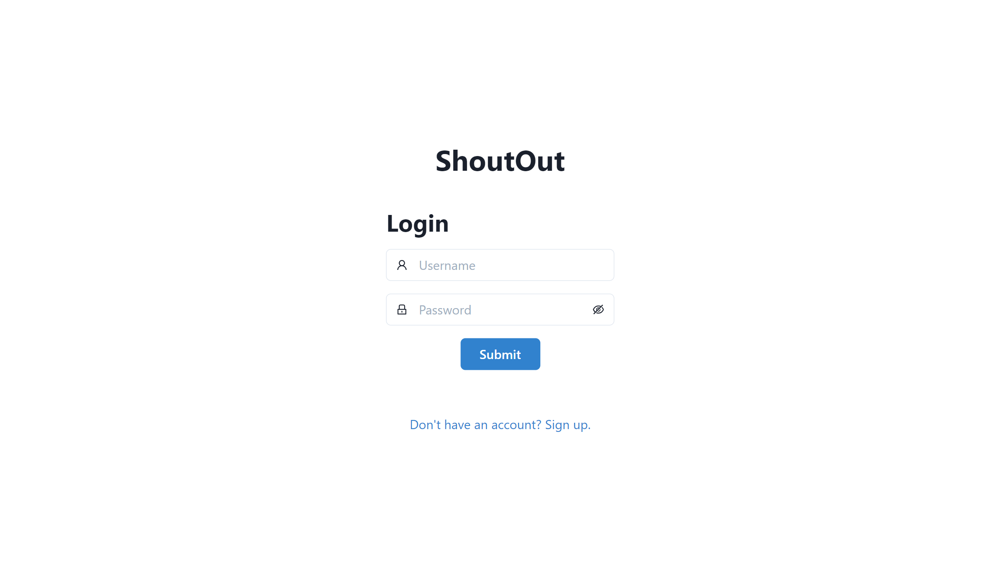

### Signup Page

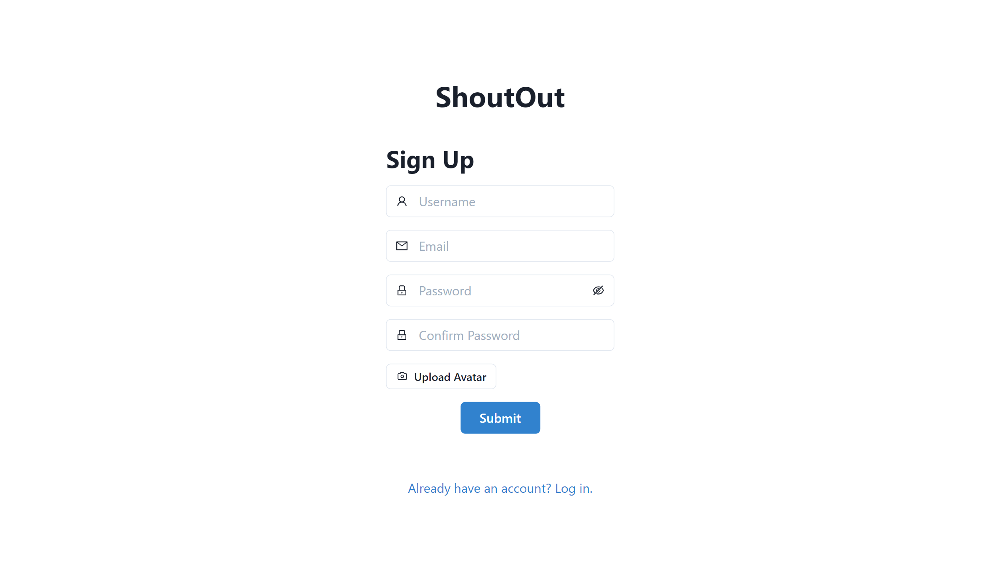

### Empty Feed

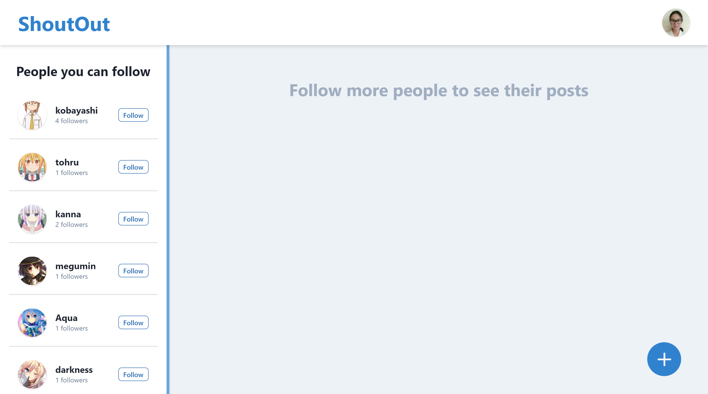

### Profile Menu

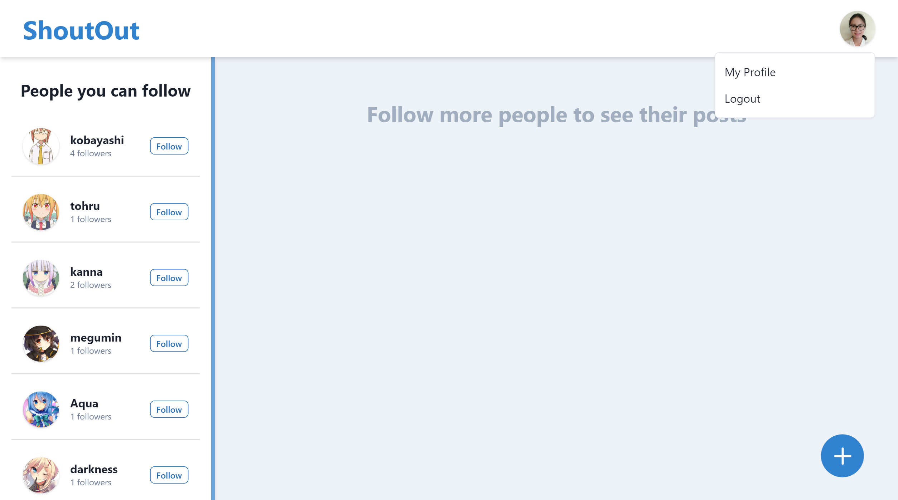

### Empty profile Page

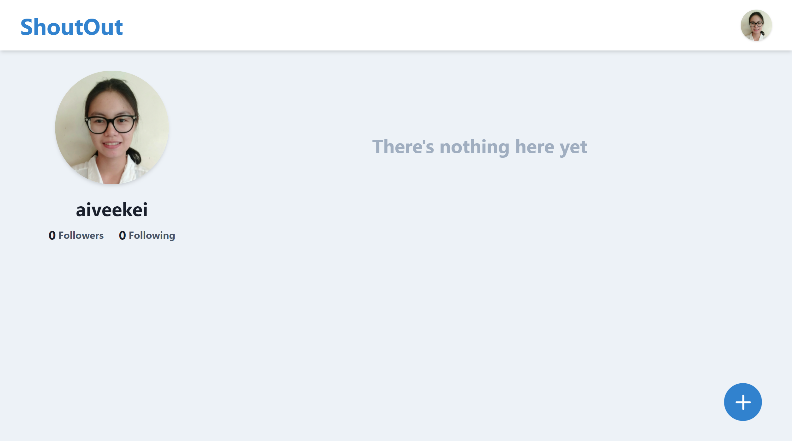

### Create new post dialog

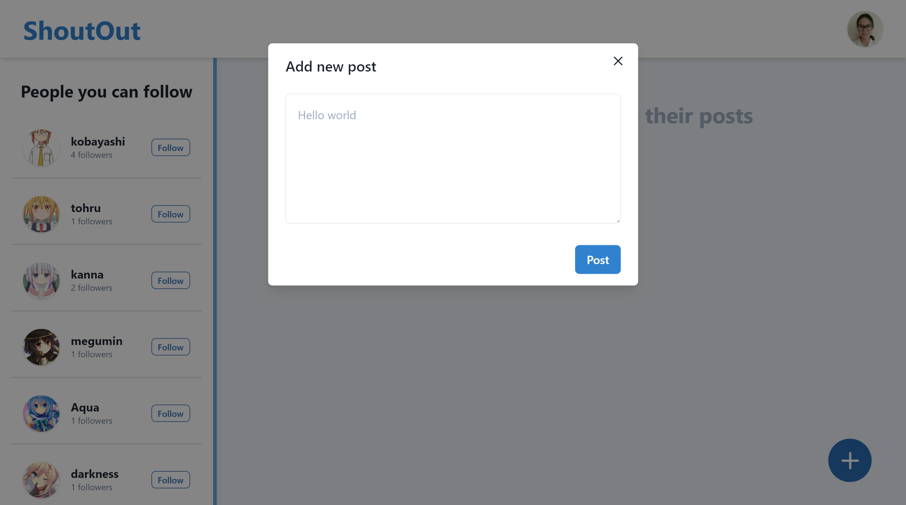

### Profile Page with Post

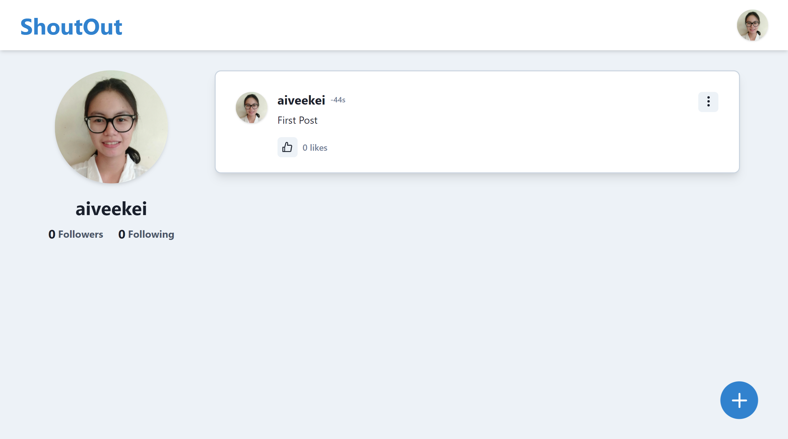

### Post delete option

### Follow a user through suggestions panel

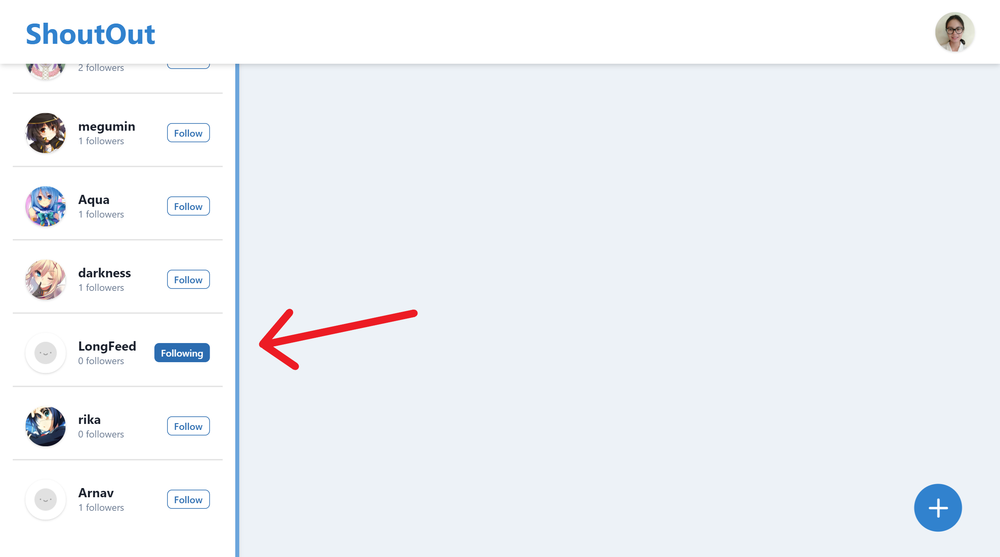

### Feed with few following

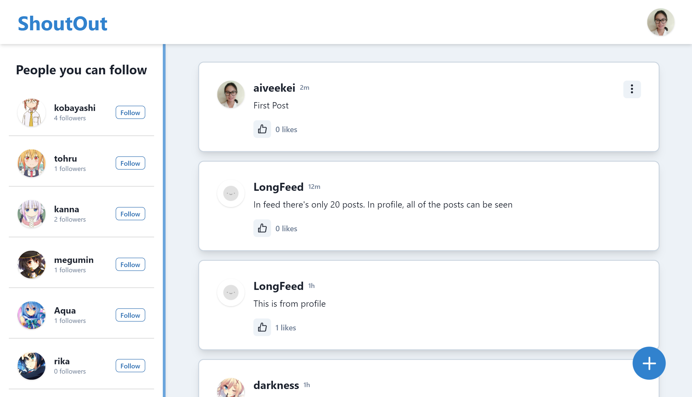

### Like/Unlike Posts

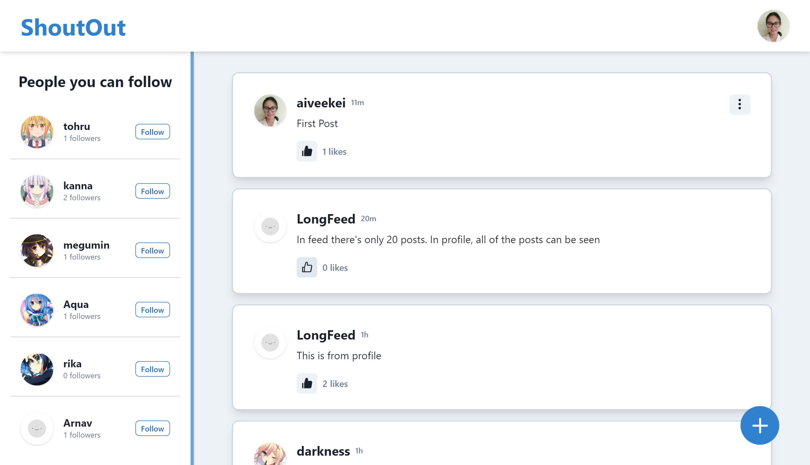

### Other User's Profile Page

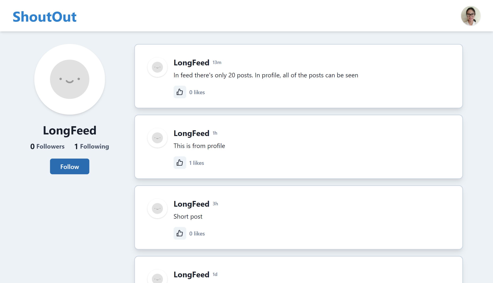

### Follow/Unfollow a user in Profile Page

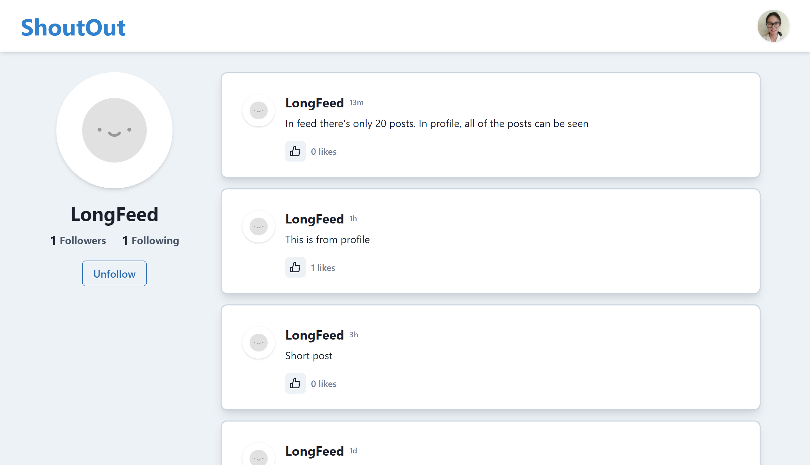