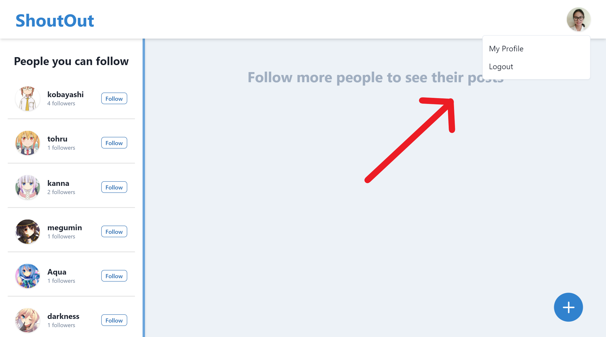
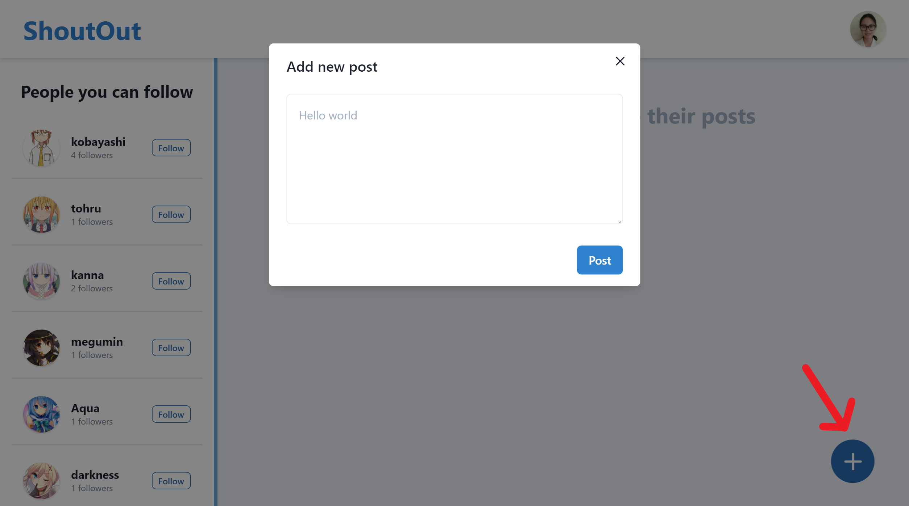
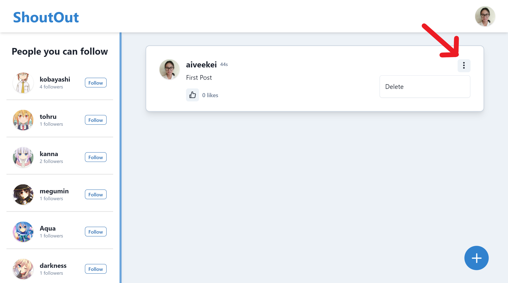

# Front end

[Netlify Link](https://inspiring-noether-356180.netlify.app)

## Packages included:
    - react-router-dom
    - redux
    - react-redux
    - redux-thunk
    - redux-logger
    - react-icons
    - axios
    - styled-components

## UI Library used:
    - Chakra UI

## Pages
    - /login
    - /signup
    - /feed
    - /profile/:username

### Login Page

### Signup Page

### Empty Feed

### Profile Menu

### Empty profile Page

### Create new post dialog

### Profile Page with Post

### Post delete option

### Follow a user through suggestions panel

### Feed with few following

### Like/Unlike Posts

### Other User's Profile Page

### Follow/Unfollow a user in Profile Page

